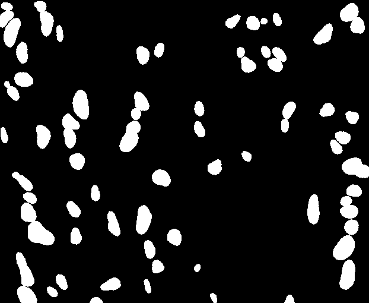

# Create-masks_from-Polygon-created-by-Cytomine

# First is to convert data exported from cytomine to csv file 

# Run prepare.py

python prepare.py --cytomine_file ./data.csv --output_path ./output

# Run convert.py

python convert.py --image_id      #images and id as list [[image,id],[image,id],...]
                  --images        #./images
                  --csv_data      # ./data_csv
                  --output        # ./output
                  
# Output

                  

